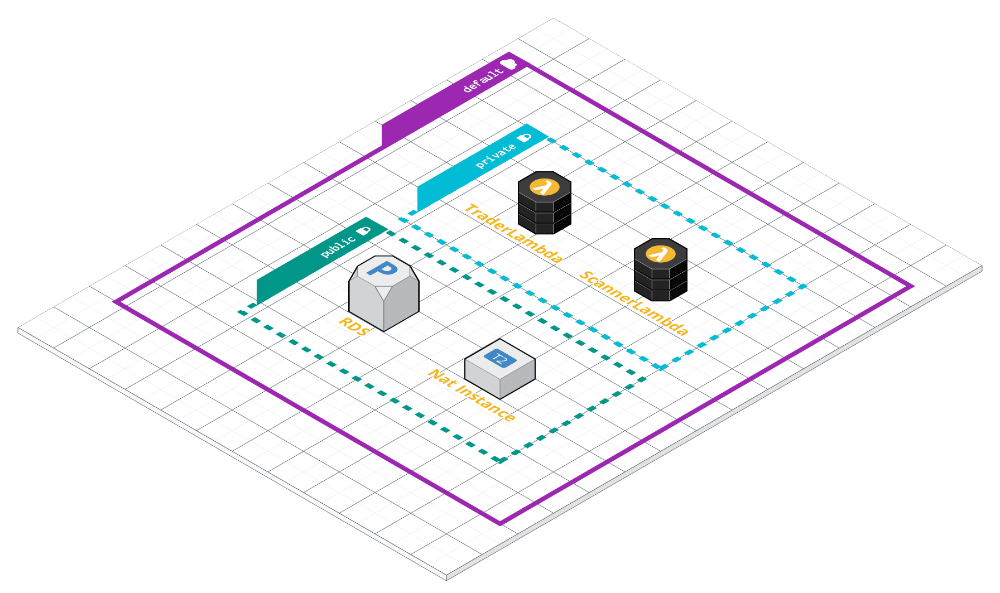

# Bitrush

Bitrush는 파이썬으로 작성된 비트코인 트레이딩 봇입니다.
업비트 API를 사용하여 실시간, 일봉 차트 데이터를 조회하고 매수/매도를 진행합니다.

## Features

1. 백테스트
    
    [backtrader](https://www.backtrader.com) 라이브러리를 사용하여 백테스팅을 진행한 샘플 코드입니다. (`backtest/`)

2. 시세 크롤링

    백테스팅/매매 시 사용될 과거 시세 데이터를 크롤링합니다. (`scanner.py`)

3. 매매

    과거 시세 데이터 등을 바탕으로 정해진 전략에 따라 매매를 수행합니다. (`trader.py`)

## Getting Started

Bitrush를 실행시키려면 몇 가지 준비가 필요합니다.

1. 업비트 Open API 사용 신청 후 엑세스토큰/시크릿키 발급 받기

    업비트에 회원 가입한 후 [업비트 Open API 안내 페이지](https://upbit.com/service_center/open_api_guide)에서 엑세스토큰/시크릿키를 발급 받습니다. 필요한 권한을 선택한 후 [IP 확인](https://www.myip.com)에서 IP를 확인하여 기입합니다.

2. 텔레그램 봇 생성 후 엑세스토큰/채팅ID 기록하기

    매수/매도 알림을 받기 위해서는 텔레그램 봇을 생성한 후 해당 봇과의 채팅ID가 필요합니다.

    - [텔레그램 봇 생성하는 법](https://blog.cosmosfarm.com/archives/1070/텔레그램-봇-telegram-bot-만들기/)
    - [채팅 ID 확인하는 법](https://gabrielkim.tistory.com/entry/Telegram-Bot-Token-및-Chat-Id-얻기)

3. AWS SSM 변수 설정

    serverless.yaml 파일에 명시된 환경 변수를 추가해줍니다.

## Test

로컬에서 각 람다를 실행시키기 위해서는 [도커 클라이언트](https://www.docker.com/products/docker-desktop)가 필요합니다. 

도커 클라이언트를 실행시킨 뒤, 프로젝트 루트에서 `docker build -t bitrush .`를 실행하여 이미지를 빌드합니다.

이후 `docker run -p 8080:8080 bitrush`를 통해 로컬에서 람다를 실행시킵니다.

이제 아래 명령어를 통해 로컬에서 테스트를 진행할 수 있습니다.

```curl
curl -XPOST "http://localhost:8080/2015-03-31/functions/function/invocations" -d '{}'
```

## Deploy

[aws-cli](https://github.com/aws/aws-cli)를 설치한 후 기본 설정을 완료합니다.

이후 AWS 아키텍쳐를 아래와 같이 설정해줍니다.



배포 명령어)

```bash
ecr 레포지토리 생성 후 package.json의 config.ecr_image를 변경

npm run ecr:login # --profile 부분을 변경한다. ex) --profile default

npm run ecr:push

npm install -g serverless # serverless framework 생성

npm run deploy
```

## Caveats

비트코인 트레이딩은 고위험입니다. 소액으로 검증을 한 뒤 본격적인 투자를 하기 바랍니다. 또한 어떤 상황에도 수익을 올릴 수 있는 전략은 존재하지 않습니다. 백테스팅 등을 통해 전략을 검증한 후에 사용하시길 바랍니다.

Q: IP 주소가 일치하지 않는다는 에러가 발생합니다.

    업비트 API는 IP 기반으로 인증이 이뤄지기 때문에 람다에서는 Nat Instance의 IP 주소로 엑세스토큰/시크릿키를 발급받은 뒤 사용해야 합니다.
